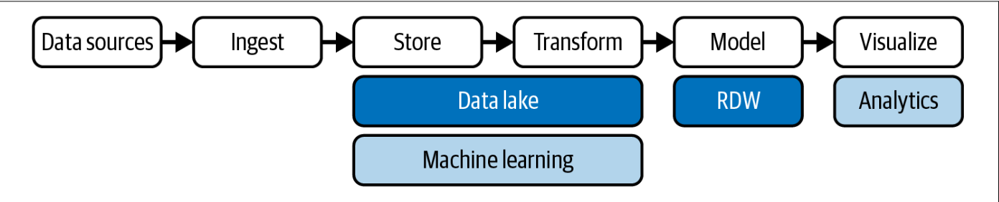
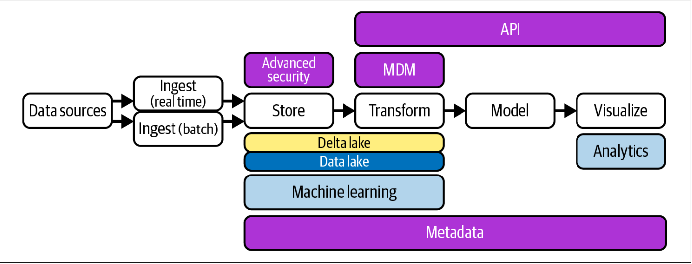
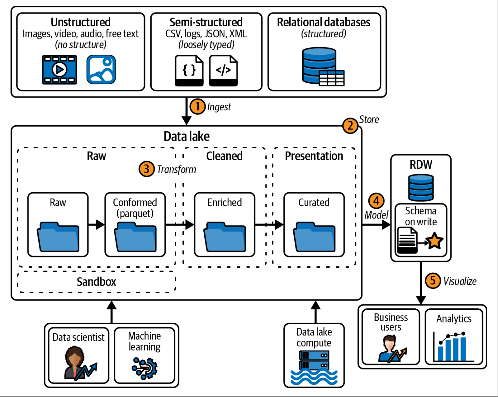
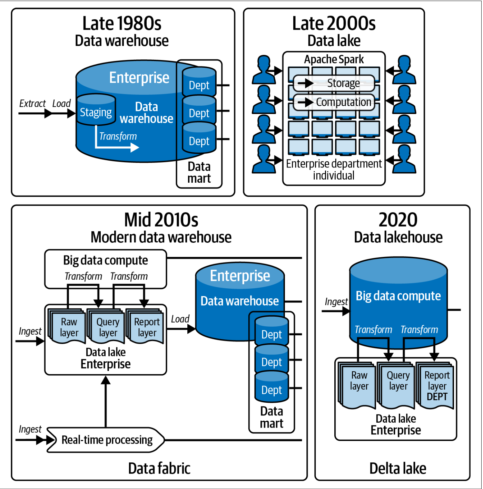

## Notes From The Book

### Modern Data Warehouse overview

### Lakehouse overview

- **Descriptive analytics** and diagnostic analytics are two important types of data analysis
that are commonly used in business. Descriptive analytics involves analyzing data to
describe past or current events, often through the use of summary statistics or data
visualizations. This type of analysis is used to understand what has happened in the
past and to identify patterns or trends in the data that can help with decision making.

**Diagnostic analytics** is used to investigate the causes of past events, typically by exam‐
ining relationships between different variables or factors. This type of analysis can
identify the root causes of problems or diagnose issues that may be affecting business
performance.

Suppose a company wants to analyze sales data from the past year. Descriptive analyt‐
ics would involve calculating summary statistics such as total sales revenue, average
sales per day, and sales by product category to understand what happened. Diagnostic
analytics, in contrast, would examine relationships between factors (such as sales and
marketing spend, or seasonality and customer demographics) to understand why
sales fluctuated throughout the year. By combining both approaches, companies can
gain a deeper understanding of their data and make more informed decisions. 

- How to determine what has changed since last data extraction: Timestamps, cdc,
  partionining: some source systems use range partionining, in which the source
  tables are partitioned alng a date key. For example if you are extractingafrom
  an orders table partioned by day, it is easy to identify the current or
previous days data. Other methods of detection are: Database triggers, merge
staements. Merge statement approach is owrst because its a full dump of source
systems, then a potentially huge diff operation in the data warehouse.

- Explain clearly schema on read vs schema on write

- Data lake is a bottom-up to data managment. while a traditional relation data
  warehouse is a top-down approach. Main difference is that a lake requires no
upfront work and is ideal for situations where we dont know what questions to
ask yet.

- **Predictive analytics** makes use of data, statistical algorithms, and machine learning
techniques to predict future outcomes based on historical data. It includes a variety of
statistical techniques, such as data mining, predictive modeling, and machine learn‐
ing, to analyze current and historical facts to make predictions about future or other‐
wise unknown events. This allows you to be proactive, not just reactive. For instance,
predictive analytics** can be used in healthcare to forecast patient readmission rates, in
retail to predict future sales, or in banking to predict loan defaults.

**Prescriptive analytics** goes a step further than predictive analytics. It utilizes optimiza‐
tion and simulation algorithms to advise on possible outcomes. Prescriptive analytics
not only predicts what will happen in the future but also suggests actions to take to
affect those outcomes. The goal is to provide advice based on predicted future scenar‐
ios to optimize decision making. Prescriptive analytics can suggest decision options
on how to take advantage of a future opportunity or mitigate a future risk, and it can
illustrate the implications of each decision option. For example, in logistics, prescrip‐
tive analytics can be used to find the best routes for delivery and even suggest alter‐
nate routes in case of unexpected road closures.
Data lakes were used mainly for predictive and prescriptive analytics at first to avoid
the difficulties of trying to perform advanced analytics with the traditional data ware‐
house.

If you find valuable data in the data lake when exploring and you want to make it
easily accessible to end users, you can always model it later by copying it to an RDW.
Data modeling is like creating a blueprint for organizing and understanding data. It
helps define what data is important, how it’s related, and how it should be stored and
used in an RDW. Data lakes have limited tools for data modeling, while DWs have
had modeling tools for years.

- page 71 multiple data lakes. It just feels wrong but could potetially be valid
  if data has to be seperated by region for example etc.
- page 76-78 about data marts and ODS was good.

- page 83-85 abput data virtualization is very interesting, the idea is quite
new to me

- On Data design VS data modelling: Think of data design as like building a city. It’s about deciding where
the buildings go, which roads connect different parts of the city, and how traffic
flows. On the other hand, data modeling is more like designing individual buildings—
it’s about arranging rooms, deciding how they connect, and defining the purpose of
each room.

- Chapter 8 was quite weak

- chapter 9 nothing new for me

- Side note while reading: I think given the limited expertise and experience
the MDW artchitecture is the best one for us. We can always migrate to a full
lakehouse model later since much of the foundation is shared between the two
architectures.

- 
 
- page 140-141 pros and cons for MDW

- chapter 11 quite weak

- 

- Skills needed for building the data platform:
  - Data Architect
  - Data Engineer
  - Data Scientist
  - Analyst's. Business, analytics engineer etc.

- Risks when building a new data platform:
  - Thinking BI is easy
  - Too many or too few business requirements
  - Structuring the DW to reflect source data rather than the business needs
  - Presenting the end users with a solution that is slow or has bad performance
  - Not involving users, showing them results and getting them excited

---
[status](status): :📖:
tags: [[Book notes]] - [[030 Software Development.md]] - [[001 Book Index.md]]
date: 2025-09-27
